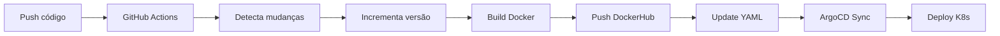

# GitHub Actions - CI/CD Pipeline

Automação completa do pipeline de build, push e deploy do TP2.

## 🔧 Configuração Inicial

### 1. Adicionar Secrets no GitHub

Vá em **Settings → Secrets and variables → Actions** e adicione:

- `DOCKER_PASSWORD`: Sua senha do DockerHub

### 2. Workflows Disponíveis

#### `ci-cd.yml` - Build Manual (Versão Fixa)
Usa as versões definidas nos YAMLs do K8s.

**Triggers:**
- Push na `main` com mudanças em `ml/`, `api/` ou `k8s/`
- Tag `[ml]` ou `[api]` na mensagem de commit
- Execução manual

**Exemplo:**
```bash
git commit -m "feat: adiciona cache [ml]"
git push
```

#### `auto-version.yml` - Build Automático com Versionamento
Incrementa versões automaticamente quando detecta mudanças.

**Triggers:**
- Push na `main` com mudanças em `ml/` ou `api/`
- Execução manual (escolhe componente)

**Comportamento:**
1. Detecta mudanças em `ml/` ou `api/`
2. Incrementa versão automaticamente (0.9 → 0.10)
3. Atualiza YAMLs do K8s
4. Build e push da imagem Docker
5. ArgoCD detecta e faz deploy

## 🚀 Uso

### Workflow Recomendado

**1. Desenvolvimento local:**
```bash
# Fazer mudanças no código
vim ml/train_model.py

# Testar localmente
./tests/test_local.py

# Commit e push
git add ml/train_model.py
git commit -m "feat: melhora performance do FPGrowth"
git push
```

**2. GitHub Actions executa automaticamente:**
- ✅ Detecta mudança em `ml/`
- ✅ Incrementa versão (ex: 0.9 → 0.10)
- ✅ Atualiza `k8s/job-ml.yaml`
- ✅ Build da imagem Docker (linux/amd64)
- ✅ Push para DockerHub
- ✅ Commit da mudança de versão

**3. ArgoCD detecta e deploya:**
- ⏱️ Em ~3 minutos, ArgoCD faz sync
- 🚀 Novo pod é criado com a imagem atualizada

### Execução Manual

**Via interface do GitHub:**
1. Vá em **Actions**
2. Escolha `Auto Version & Deploy`
3. Clique em **Run workflow**
4. Selecione componente (ml, api, ou both)

**Via CLI do GitHub:**
```bash
gh workflow run auto-version.yml -f component=ml
```

## 📊 Monitoramento

### Ver logs do workflow
```bash
gh run list
gh run view <run-id> --log
```

### Ver status do ArgoCD
```bash
argocd app get tp2-app
argocd app sync tp2-app  # Força sync manual
```

### Ver pods no Kubernetes
```bash
kubectl -n tassioalmeida get pods -w
kubectl -n tassioalmeida logs -l job-name=tp2-ml-job -f
```

## 🔄 Fluxo Completo



## 🐛 Troubleshooting

### Build falha com erro de autenticação
```bash
# Verifique se o secret está correto
gh secret list

# Atualize se necessário
gh secret set DOCKER_PASSWORD
```

### Versão não incrementou
- Verifique se o commit não tem `[skip ci]` na mensagem
- Verifique se há mudanças reais em `ml/` ou `api/`

### ArgoCD não fez sync
```bash
# Força sync manual
argocd app sync tp2-app

# Verifica status
argocd app get tp2-app
```

## 📝 Notas

- Commits com `[skip ci]` na mensagem **não** acionam workflows
- Builds usam cache do GitHub Actions para acelerar
- Imagens são multi-plataforma (linux/amd64)
- ArgoCD faz polling a cada 3 minutos (padrão)

